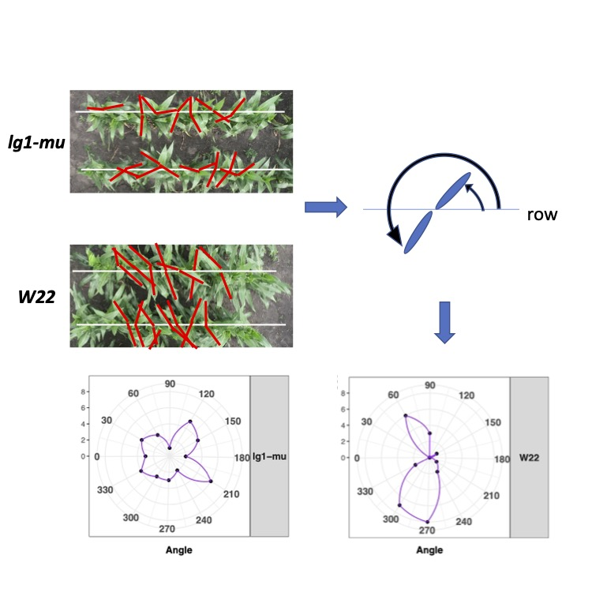
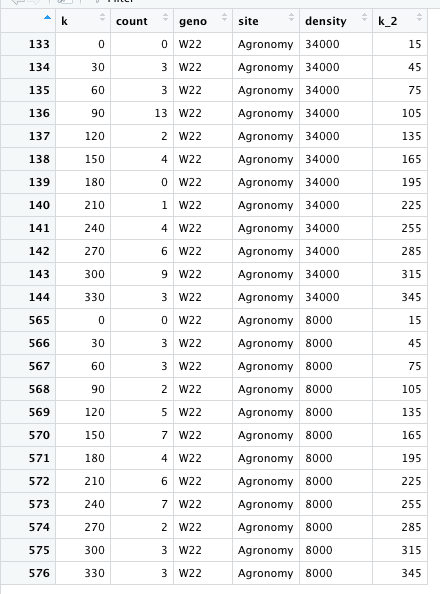
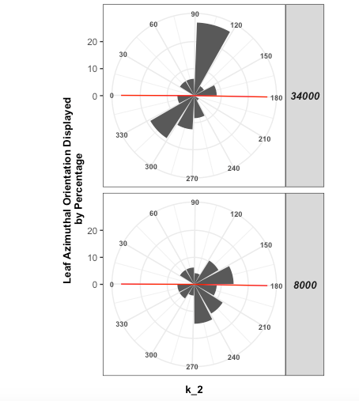

# Tutorial for phyllotaxy images analysis

## Introduction 

Here we aim to evaluate the maize plant canopy orientation by directly measure azimuthal leaf orientations from top view UAV images.
Each image normally contains four rows of plants with same genotype. The middle two rows will be selected for the measurement.
The relative angles to the planting row of the top-most leaves from each side of a plant are then measured using imageJ. This enable us to display the distribution of the azimutal angles of these leaves in a polar chart.

As shown in the following image, the mutant and its relative wild type control exhibit different canopy orientation.

## Chapters

1. Image analyses
2. Codes for polar charts
3. Codes for statistic analysis 

#  Chapter 1 Image Analyses

In each image, angles of azimuthal canopy orientation were measured from N (normally 6 plants) consecutive plants from each of the two middle rows of four-row plots. These plants exhibited the typical alternate-distichous phyllotaxy of maize. The top-most fully expanded leaf was selected from each side of each plant (Supplemental Figure S22). Thus 2N plants, i.e., 4N leaves per genotype per replication, were measured.

For 60 DAP plants, where the tassel can be seen in the image. The three top-most leaves, the flag leaf and the two leaves below the flag leaf, were in most instances still upright and not fully expanded and thus were not measured. As a result, the measured leaves were typically the third and fourth leaves below the flag leaf. The younger stages plants, such as 50 or 40 DAP, there would normally 4 to 5 leaves that were not fully expanded and shall be skipped for data collection. Thus, it would be the topmost and second topmost collar leaves that were collected for plants at 40 or 50 DAP. 

Beginning at the axis of planting, the counterclockwise angle between the axis of planting and the midrib (Supplemental Figure S22) was measured for each selected leaf, using the angle measurement function of ImageJ software (https://imagej.nih.gov/ij/). 

A measured sample can be found at W22.csv which shall looks like folowing:

Plot column is rep. G column marks the genotype. The value is the returning value using image J. Each plant has two values, which marked in column plant by 1 or 2. 1 means the the angle of upper side of the planting axis or row (0 to 180 degree)and 2 means the angle from bottom side of the row (180-360 to row). Since for wild type plants, the plants prefer to form azimutal angles that close to perpendicular to the plant axis or row. Normally we would expect the returned values in the value column would be first value from upper side and second value from bottom side. Which would looks 1, 2, 1, 2, 1, 2 etc..

However, sometimes the plants can have both leaves showing up at both upper of bottom side so the different plane column is provided to mark this info. If it is 1, for column plant with value of 1, this means the angle is from bottom side. If it is 1 at plane column but plant column value is 2 then it means this leaves is from upper side. This info is important for later drawing the polar chart to visualize the azimutal distribution of leaves.

Column Angle_transformed displayed the value that mark the counter colock wise angle to the planting axis displayed in a 0-360 degree format. With odd number in the plant column displayed as 0-180 (same value as value column) and even number in the plant column displayed as 180-360 (360-the value in calue column). For the ease to display in the polar chart, which we would display the number of observations in very 30 degree from 0 to 360. The values in Angle_transformed were furher round up in column Orien. 

To test for differences between the angles of azimuthal canopy orientations between mutants and their wild-type inbred controls, the angles from ImageJ were subtracted from 90° if the angle was ≥ 0 and ≤ 180° or 270° if the angle was > 180°. The absolute values then therefore represented the degree of deviation from being perpendicular to axis of planting. Which can be found in the Abs_deviation column. A high value indicates that the measured leaf is strongly deflected from the interrow space. The calculated values were then used to estimate the genotypic effects on the degree of deviation using the ‘lm’ function of R. 

#  Chapter 2 Code for polar chart

The code is for full dataset with muptiple location and reps so you can modify it accordingly. 

Be aware I dropped the codes on the rep with marked by "#" sign, which means this simply combined everything from one location and group them by density.

    k<-seq(0,330,by=30)
    k<-as.data.frame(k)
    k$count<-NA
    orien_summary<-NULL
    location<-c("Agronomy","Johnson")
    dense<-c("34000","18400","12600","8000")
  
    for (x in 1:2) {
    ll<-location[x] 
    lol_c_l<-subset(data,Field==ll) # get data into field
    # for (i in 1:2) {
  
    #  reps<-subset(lol_c_l,rep==i) #get the rep
    for (v in 1:4) { 
      ds<-dense[v] #four densities
      reps_d<-subset(lol_c_l,d_acre==ds)
    
      for (j in 1:length(t)) {
        geno<-t[j]
        ra<-subset(reps_d,G==geno)
        s_k<-as.data.frame(table(ra$Orien))
        d<-k
        if (!nrow(s_k)==0) {
          for (m in 1:nrow(k)) {
          
            angle<-d[m,1]
            sub_a<-subset(s_k,Var1==angle)
            if (!nrow(sub_a)==0) {
              d[m,2]<-sub_a[1,2]
          }else{
            d[m,2]<-0
          }
        }
      }else{}
      d$geno<-rep(geno,nrow(d))
      #d$replicate<-rep(paste0("rep",i),nrow(d))
      d$site<-rep(ll,nrow(d))
      d$density<-rep(ds,nrow(d))
      sum(d$count)
      orien_summary<-rbind(orien_summary,d)
        }
      }
  
        # }
      }
      orien_summary_s<-subset(orien_summary,site=="Agronomy")
    orien_summary_s<-subset(orien_summary_s,density%in%c("34000","8000"))
    orien_summary_s$k_2<-orien_summary_s$k+15 # this is to make polar chart value to be centered at each 30 degree interval

    w22_60<-subset(orien_summary_s,geno=="W22")
    w22_60$time<-rep("60DAP",nrow(w22_60))

The results would look like below:

This way we can use ggplot2 to make polar chart. First we need transform counts into percentage. Be aware the following data is combined two replicate from each density into one dataset so we have 48 observations in each density. 

    w22_60$count<-(w22_60$count/48)*100

Then we use ggplot2 to draw polar chart.

        ggplot(data=w22_c,aes(x=k_2,y=count))+
          geom_bar(stat = "identity",alpha=1)+theme_bw()+
          facet_grid(rows=vars(density)
          #,cols=vars(time) # groupd by density and timepoints this lines can be modified if you have mutiple time points or density
          )+ 
          scale_x_continuous( breaks = seq(0, 360, by = 30))+
          theme(strip.text.y = element_text(angle = 0))+
          xlab("Days After Planting")+
          ylab("Leaf Azimuthal Orientation Displayed\n by Percentage")+
          geom_vline(xintercept = 0,  
                     color = "red", size=0.5)+
          geom_vline(xintercept = 180,  
                     color = "red", size=0.5)+
          coord_polar(start =11)+ # setting start at 0 degree 
          theme_bw()+  theme(strip.text.y = element_text(angle = 0))+
          theme(axis.title = element_text(face = "bold",size=10),
                axis.text.x = element_text(face = "bold",size=7),
                strip.text = element_text(size = 10,face = "bold"),
                strip.text.y = element_text(face = "bold.italic"))

You will have something like this:

